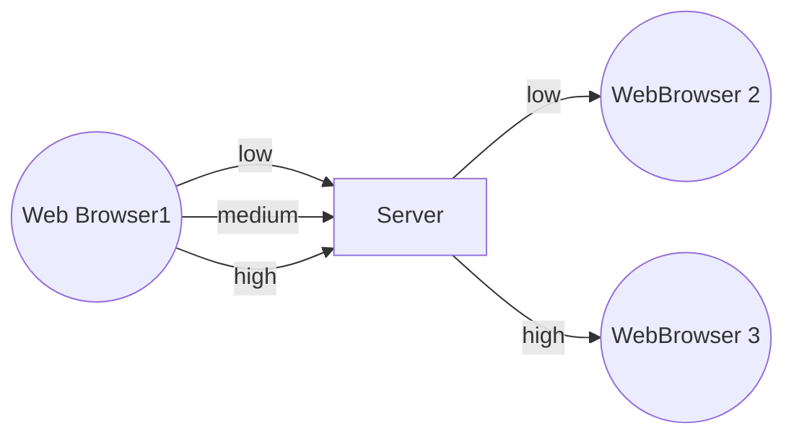

# Simulcast

Simulcast is a technique where a client sends multiple encodings of the same video to the server, which is then responsible for dynamically choosing the appropraite encoding for every peer (other client).
Encodings differ between each other in resolution and/or frame rate.
The selection of the encoding is based on:
* Receiver available bandwidth.
* Receiver preferences (e.g. explicit request to receive video at HD resolution instead of FHD).
* UI layout (e.g. videos displayed in smaller tiles will be sent at a lower resolution).

Simulcast is not utilized in direct client-client connections (no intermediate server) because in such cases, 
the sender can adjust its resolution or frame rate based on a feedback from the receiver.

Elixir WebRTC comes with:
* Support for inbound simulcast - it allows to receive multiple incoming resolutions
* RTP munger and keyframe detectors, which can be used for implementing encoding switching on the server side

Currently there is no support for:
* Outbound simulcast
* Bandwidth estimation
* Automatic encoding switching



## Turning simulcast on

### Elixir WebRTC

Elixir WebRTC automatically accepts incoming simulcast tracks so there are no extra steps required.

### JavaScript 

Simulcast can be enabled when adding a new track. For example:

```js
const pc = new RTCPeerConnection();

const localStream = await navigator.mediaDevices.getUserMedia({
  video: {
    width: { ideal: 1280 },
    height: { ideal: 720 },
  },
});

pc.addTransceiver(localStream.getVideoTracks()[0], {
  streams: [localStream],
  sendEncodings: [
    { rid: 'h', maxBitrate: 1500 * 1024 },
    { rid: 'm', scaleResolutionDownBy: 2, maxBitrate: 600 * 1024 },
    { rid: 'l', scaleResolutionDownBy: 4, maxBitrate: 300 * 1024 },
  ],
});
```

> #### Minimal starting resolution {: .warning}
> To run 3 simulcast encodings, the minimal starting resolution
> must be 960x540. See more [here](https://source.chromium.org/chromium/chromium/src/+/main:third_party/webrtc/video/config/simulcast.cc;l=79?q=simulcast.cc).


## Receiving simulcast packets

When simulcast is enabled, packets are labeled with an `rid`, which denotes simulcast
encoding that a packet belongs to:

```elixir
{:ex_webrtc, input_pc_pid, {:rtp, input_track_id, rid, packet}}
```

## Switching between simulcast encodings

Switching between simulcast encodings requires some modifications to RTP packets.
Every encoding starts with a random RTP sequence number and a random RTP timestamp.
Because client that receives our stream is never aware of simulcast (they always receive
a single encoding), we have to rewrite those sequence numbers and timestamps to be continuous and increasing.
This process is known as munging.

1. Create munger with codec sample rate

```elixir
alias ExWebRTC.PeerConnection
alias ExWebRTC.RTP.{H264, Munger}

m = Munger.new(90_000)
```

2. When a packet from an encoding that we want to forward arrives, rewrite its sequnce number and timestamp:

```elixir
receive do
  {:ex_webrtc, input_pc, {:rtp, _input_track_id, "m", packet}} ->
    {packet, munger} = Munger.munge(munger, packet)
    :ok = PeerConnection.send_rtp(output_pc, output_track_id, packet)
  {:ex_webrtc, input_pc, {:rtp, _input_track_id, _rid, packet}} ->
    # ignore other packets
end
```

3. To switch to another encoding, request a keyframe for this encoding.
Once the keyframe arrives, update the munger and start forwarding new packets.
For example, transitioning from encoding `m` to `h`:


```elixir
# assume we have the following state
state = %{
  current_encoding: "m", 
  munger: munger, 
  input_pc: input_pc,
  input_track_id: input_track_id,
  output_pc: output_pc, 
  output_track_id: output_track_id
}

:ok = PeerConnection.send_pli(state.input_pc, state.input_track_id, "h")

# ...

receive do
  {:ex_webrtc, input_pc, {:rtp, _input_track_id, rid, packet}} ->
    cond  do
      rid == state.current_encoding -> 
        {munger, packet} = Munger.munge(munger, packet)
        :ok = PeerConnection.send_rtp(state.output_pc, state.output_track_id, packet)
        %{state | munger: munger}
      rid == "h" and H264.keyframe?(packet) ->
        munger = Munger.update(munger)
        {munger, packet} = Munger.munge(munger, packet)
        :ok = PeerConnection.send_rtp(state.output_pc, state.output_track_id, packet)
        %{state | munger: munger, current_encoding: "h"}
      true ->
        state
    end
end
```

See our [Broadcaster](https://github.com/elixir-webrtc/apps/blob/master/broadcaster/lib/broadcaster/forwarder.ex) app source code for more.
