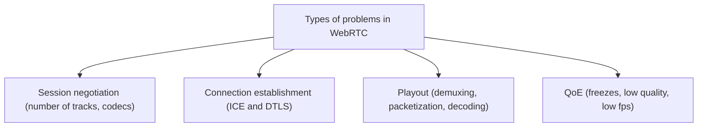

# WebRTC debugging

**It is also worth taking a look at [debugging](../advanced/debugging.md)**

In most cases, when **something** does not work, we try to find the problem according to the following workflow:
1. Check whether session has been negotiated successfully.
1. Check whether connection (ICE and DTLS) has been established.
1. Check whether RTP packets are demuxed, frames assembled and decoded.
1. Check QoE statistics - freezes, jitter, packet loss, bitrate, fps.
 

## Session Negotiation

Here, we just validate that SDP offer/answer looks the way it should.
In particular:
1. Check number of audio and video mlines.
1. Check if any mlines are rejected (either by presence of port 0 in the m="" or a=inactive).
In most cases port is set to 9 (which means automatic negotiation by ICE) or if ICE is already in progress or this is subsequent negotiation, it might be set to a port currently used by the ICE agent. Port 0 appears when someone stops transceiver via [`stop()`](https://developer.mozilla.org/en-US/docs/Web/API/RTCRtpTransceiver/stop).
1. Check  mlines directions (a=sendrecv/sendonly/recvonly/inactive)
1. Check codecs, their profiles and payload types.
1. Number of mlines between offer and answer cannot change. 
This means that if one side offer that it is willing to only receive a single audio track,
everything the other side can do is either confirm it will be sending or decline and say it won't be sending. 
If the other side also wants to send, additional negotiation has to be performed **in this case**.

SDP offer/answer can be easily checked in chrome://webrtc-internals (in chromium based browsers) or (about:webrtc in FF).  

## Connection establishment

WebRTC connection state (PeerConnection or PC state) is a sum of ICE connection state and DTLS state.
In particular, PC is in state connected when both ICE and DTLS is in state connected.

The whole flow looks like this:
1. ICE searches for a pair of local and remote address that can be used to send and receive data.
1. Once a valid pair is found, ICE changes its state to connected and DTLS handshake is started.
1. Once DTLS handshake finishes, DTLS changes its state to connected and so the whole PC.
1. In the meantime, ICE continues checking other pairs of local and remote address in case there is better path. 
If there is, ICE seamlessly switches to it - the transmission is not stopped or interrupted.

More on ICE, its state changes, failures and restarts in section devoted to ICE.

In most cases, DTLS handshake works correctly. Most problems are related to ICE as it's pretty complex protocol.

Debugging ICE:

1. Check ICE candidates grid in chrome://webrtc-internals or about:webrtc
1. Turn on debug logs in ex_ice or chromium (via command line argument). FF exposes all ICE logs in about:webrtc->Connection Log. 
Every implementation (ex_ice, chromium, ff) is very verbose.
You can compare what's happening on both sides.
1. Try to filter out some of the local network interfaces and remove STUN/TURN servers to reduce complexity of ICE candidate grid, amount of logs and number of connectivity checks.
In ex_webrtc, this is possible via [configuration options](https://hexdocs.pm/ex_webrtc/0.14.0/ExWebRTC.PeerConnection.Configuration.html#t:options/0).
1. Use Wireshark. 
Use filters on src/dst ip/port, udp and stun protocols.
This way you can analyze whole STUN/ICE/TURN traffic between a single local and remote address.

Debugging DTLS:

This is really rare.
We used Wireshark or turned on [debug logs in ex_dtls](https://hexdocs.pm/ex_dtls/0.17.0/readme.html#debugging). 

## Playout

If both session negotiation and connection establishment went well, you can observe packets are flowing but nothing is visible in the web browser, the problem might be in RTP packets demuxing, frames assembly or frames decoding on the client side.

1. We heavily rely on chrome://webrtc-internals here. 
1. Check counters: packetsReceived, framesReceived, framesDecoded, framesDropped.
1. E.g. if packetsReceived increases but framesReceived does not, it means that there is a problem in assembling video frames from RTP packets. This can happen when:
    1. web browser is not able to correctly demux incoming RTP streams possibly because sender uses incorrect payload type in RTP packets (different than the one announced in SDP) or does not include MID in RTP headers. 
    Keep in mind that MID MAY be sent only at the beginning of the transmission to save bandwidth.
    This is enough to create a mapping between SSRC and MID on the receiver side.
    1. marker bit in RTP header is incorrectly set by the sender (although dependent on the codec, in case of video, marker bit is typically set when an RTP packet contains the end of a video frame)
    1. media is incorrectly packed into RTP packet payload because of bugs in RTP payloader
1. E.g. if packetsReceived increases, framesReceived increases but framesDecoded does not, it probably means errors in decoding process. 
In this case, framesDropped will probably also increase.
1. framesDropped may also increase when frames are assembled too late i.e. their playout time has passed.
1. Check browser logs. 
Some of the errors (e.g. decoder errors) might be logged.

## QoE

The hardest thing to debug.
Mostly because it very often depends on a lot of factors (network condition, hardware, sender capabilities, mobile devices).
Problems with QoE are hard to reproduce, very often don't occur in local/office environment.

1. We heavily rely on chrome://webrtc-internals here.
1. Check counters: nackCount, retransmittedPacketsSent, packetsLost. 
Retransmissions (RTX) are must have. 
Without RTX, even 1% of packet loss will have very big impact on QoE.
1. Check incoming/outgoing bitrate and its stability.
1. Check jitterBufferDelay/jitterBufferEmittedCount_in_ms - this is avg time each video frame spends in jitter buffer before being emitted for playout.
1. JitterBuffer is adjusted dynamically. 

## Debugging in production

1. Dump WebRTC stats via getStats() into db for later analysis.
1. getStats() can still be called after PC has failed or has been closed.
1. Continuous storage WebRTC stats as time series might be challenging.
We don't have a lot of experience doing it.
1. Come up with custom metrics that will allow you to observe the scale of a given problem or monitor how something changes in time.
1. E.g. if you feel like you very often encounter ICE failures, count them and compare to successful workflows or to the number of complete and successful SDP offer/answer exchanges.
This way you will see the scale of the problem and you can observe how it changes in time,  after introducing fixes or new features.
1. It's important to look at numbers instead of specific cases as there will always be someone who needs to refresh the page, restart the connection etc.
What matters is the ratio of such problems and how it changes in time.
1. E.g. this is a quote from Sean DuBois working on WebRTC in OpenAI:
    > We have metrics of how many people post an offer compared to how many people get to connected [state]. It’s never alarmed on a lot of users.
    
    Watch the full interview [here](https://www.youtube.com/watch?v=HVsvNGV_gg8) and read the blog [here](https://webrtchacks.com/openai-webrtc-qa-with-sean-dubois/#h).
1. Collect user feedback (on a scale 1-3/1-5, via emoji) and observe how it changes.

## MOS

Initially, MOS was simply asking people about their feedback on a scale from 1 to 5 and then computing avg.
Right now, we have algorithms that aim to calculate audio/video quality on the same scale but using WebRTC stats: jitter, bitrate, packet loss, resolution, codecs, freezes, etc.
An example can be found here: https://github.com/livekit/rtcscore-go

## chrome://webrtc-internals

1. Based on [getStats()](https://developer.mozilla.org/en-US/docs/Web/API/RTCPeerConnection/getStats) API
1. getStats() does not return derivatives. 
They depend on the frequency of calls to getStats() and have to be calcualted by a user.
1. chrome://webrtc-internals can be dumped and then analyzed using: https://fippo.github.io/webrtc-dump-importer/

