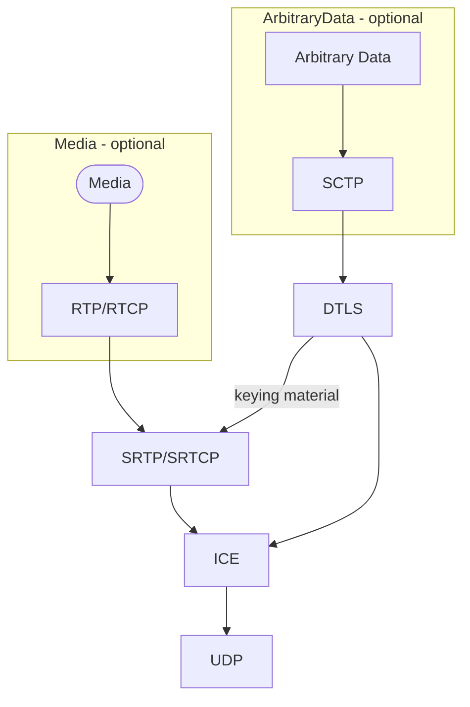

# WebRTC encryption

In WebRTC, there are two types of data:
* Media
* Arbitrary Data

## Media

Media is audio or video. 
It's sent using RTP - a protocol that adds timestamps, sequence numbers and other information
that UDP lacks but is needed for retransmissions (RTX), correct audio/video demultiplexing, sync and playout, and so on.

## Arbitrary data

By arbitrary data we mean anything that is not audio or video.
This can be chat messages, signalling in game dev, files, etc.
Arbitrary data is sent using SCTP - a transport protocol like UDP/TCP but with a lot of custom features.
In the context of WebRTC, two of them are the most important - reliability and transmission order.
They are configurable and depending on the use-case, we can send data reliably/unreliably and in-order/unordered.
SCTP has not been successfully implemented in the industry.
A lot of network devices don't support SCTP datagrams and are optimized for TCP traffic.
Hence, in WebRTC, SCTP is encapsulated into DTLS and then into UDP.
Users do not interact with SCTP directly, instead they use abstraction layer built on top of it called Data Channels.
Data Channels do not add additional fields/header to the SCTP payload.

## Encryption



1. Media is encapsulated into RTP packets but not into DTLS datagrams.
1. In the context of media, DTLS is only used to obtain keying material that is used to create SRTP/SRTCP context.
1. RTP packet **payloads** are encrypted using SRTP.
1. RTP headers are not encrypted - we can see and analyze them in Wireshark without configuring encryption keys.
1. DTLS datagrams, among other fields, contain 16-bit sequence number in their headers.


## E2E Flow

1. Establish ICE connection
2. Perform DTLS handshake
3. Create SRTP/SRTCP context using keying material obtained from DTLS context
4. Encapsulate media into RTP, encrypt using SRTP, and send using ICE(UDP)
5. Encapsulate arbitrary data into SCTP, encrypt using DTLS and send using ICE(UDP)

Points 1 and 2 are mandatory, no matter we send media, arbitrary data or both.
WebRTC communication is **ALWAYS** encrypted.

## TLS/DTLS handshake

See:
* https://tls12.xargs.org/
* https://en.wikipedia.org/wiki/Diffie%E2%80%93Hellman_key_exchange#
* https://webrtcforthecurious.com/docs/04-securing/
* https://www.ibm.com/docs/en/cloud-paks/z-modernization-stack/2023.4?topic=handshake-tls-12-protocol


1. TLS uses asymmetric cryptography but depending on TLS version and cipher suites, it is used for different purposes.
1. In TLS-RSA, we use server's public key from server's cert to encrypt pre-master secret and send it from a client to the server.
Then, both sides use client random, server random, and pre-master secret to create master secret. 
1. In DH-TLS, server's public key from server's cert is not used to encrypt anything.
Instead, both sides generate priv/pub key pairs and exchange pub keys between each other. 
Pub key is based on a priv key and both of them are generated per connection.
They are not related to e.g. server's pub key that's included in server's cert.
All params are sent unecrypted.
1. Regardless of the TLS version, server's cert is used to ensure server's identity.
This cert is signed by Certificate Authority (CA).
CA computes hash of the certificate and encrypts it using CA's private key.
The result is known as digest and is included in server's cert.
Client takes cert digest and verifies it using CA public key.
1. In standard TLS handshake, server MUST send its certificate to a client but
client only sends its certificate when explicitly requests by the server.
1. In DTLS-SRTP in WebRTC, both sides MUST send their certificates.
1. In DTLS-SRTP in WebRTC, both sides generate self-signed certificates.
1. Alternatively, certs can be configured when creating a peer connection: https://developer.mozilla.org/en-US/docs/Web/API/RTCPeerConnection/RTCPeerConnection#certificates
1. Fingerprints of these certs are included in SDP offer/answer and are checked once DTLS-SRTP handshake is completed i.e.
we take fingerprint from the SDP (which is assumed to be received via secured channel) and check it against fingerprint
of the cert received during DTLS-SRTP handshake.
1. The result of DTLS-SRTP handshake is master secret, which is then used to create so called keying material.

## Keying material

See:
* https://datatracker.ietf.org/doc/html/rfc5705#section-4
* https://datatracker.ietf.org/doc/html/rfc5764#section-4.2 

Keying material is used to create SRTP encryption keys and is derived from a master secret established during DTLS-SRTP handshake.

```
keying_material = PRF(master_secret, client_random + server_random + context_value_length + context_value, label)
```


* PRF is defined by TLS/DTLS
* context_value and context_value_length are optional and are not used in WebRTC
* label is used to allow for a single master secret to be used for many different purposes. 
This is because PRF gives the same output for the same input.
Using exactly the same keying material in different contexts would be insecure.
In WebRTC this is a string "EXTRACTOR-dtls_srtp"
* length of keying material is configurable and depends on SRTP profile
* keying material is divided into four parts as shown below:

    ```mermaid
    flowchart TD
        K["KeyingMaterial"] --> CM["ClientMasterKey"]
        K --> SM["ServerMasterKey"]
        K --> CS["ClientMasterSalt"]
        K --> SS["ServerMasterSalt"]
    ```
    
    They are then fed into SRTP KDF (key derivation function), which is another PRF (dependent on SRTP protection profile), which produces actual encryption keys.
    Client uses ClientMasterKey and ClientMasterSalt while server uses ServerMasterKey and ServerMasterSalt.
    By client and server we mean DTLS roles i.e. client is the side that inits DTLS handshake. 

### Protection profiles

See:
* https://datatracker.ietf.org/doc/html/rfc3711#section-8.2
* https://datatracker.ietf.org/doc/html/rfc7714#section-12
* https://datatracker.ietf.org/doc/html/rfc5764#section-4.1.2

Some of the protection profiles:
* AES128_CM_SHA1_80
* AES128_CM_SHA1_32
* AEAD_AES_128_GCM
* AEAD_AES_256_GCM

Meaning:
* AES128_CM - encryption algorithm (AES in counter mode) with 128-bit long key
* SHA1_80 - auth function for creating 80-bit long message authentication code (MAC)
* AEAD_AES_128_GCM - modified AES, both encrypts and authenticates

Most of the SRTP protection profiles use AES_CM as KDF.