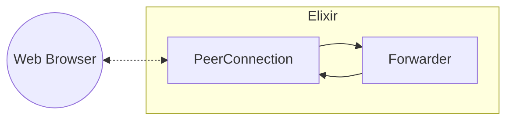
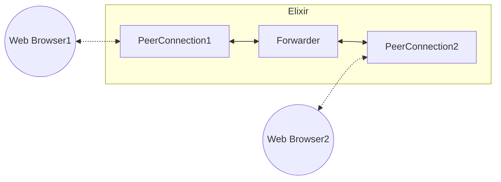
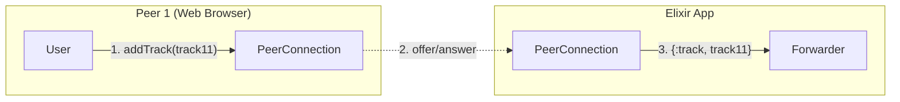
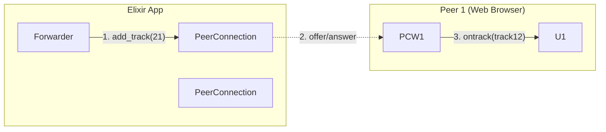

# Introduction to Elixir WebRTC

In this tutorial, we'll go through some simple use cases of Elixir WebRTC. Its purpose is to teach where you'd want to use WebRTC,
how WebRTC API looks like and how it should be used, focusing on some common caevats.

> #### Before You Start {: .info}
> This guide assumes little prior knowledge of the WebRTC API, but it would be highly beneficial
> to go through [MDN WebRTC tutorial](https://developer.mozilla.org/en-US/docs/Web/API/WebRTC_API)
> as the Elixir API tries to closely mimic the browser JavaScript API.

## What is WebRTC and where it can be used

WebRTC is an open, real-time communication standard that allows you to sent video, audio and generic data between peers over the network.
WebRTC is implemented by all of the major web browser and available JavaScript API, there's also native WebRTC clients for Android and iOS and implementation
in other programming languages ([Pion](https://github.com/pion/webrtc), [webrtc.rs](https://github.com/webrtc-rs/webrtc), and now [Elixir WebRTC](https://github.com/elixir-webrtc/ex_webrtc)).

WebRTC is the obvious choice in applications where low latency is important. It's also probably the easiest way to obtain the voice and video
from an user of your web application. Here are some example use cases:
* videoconferencing apps (one-on-one meetings of fully fledged meeting rooms, like Microsoft Teams of Google Meet)
* ingress for broadcasting services (as a presenter, you can use WebRTC to get media to a server, which will then broadcast it to viewers using WebRTC or different protocols)
* obtaining voice and video from web app users to use it for machine learning model inference on the back-end.

In general, all of the use cases come down to getting media from one peer to another. In case of Elixir WebRTC, one of the peers is usually a server, like your Phoenix backend
(although it does not have to - there's no concept of server/client in WebRTC, you might as well connect two browsers or two Elixir peers).

This is what the first part of this tutorial will focus on - we will try to get media from a web browser to a simple Elixir app.

## Getting media from a web browser to Elixir

Let's start from the web browse side of things. Firstly, we need to obtain the web-cam and microphone feeds from the browser:

```js
// a popup asking for permissions should appear after calling this function
const localStream = await navigator.mediaDevices.getUserMedia({ audio: true, video: true });
```

We used the `mediaDevices` API to get a `MediaStream` with our video and audio tracks. Now, we can start with the WebRTC itself

```js
const opts = { iceServers: [{ urls: "stun:stun.l.google.com:19302" }] }
const pc = new RTCPeerConnection(opts)
```

We've created a new `RTCPeerConnection`. PeerConnection, as the name implies, represents a connection between two WebRTC peers. Further on, this object will
be our interface to all of the WebRTC related stuff.

> #### ICE servers {: .info}
> Arguably, the most important configuration option of the `RTCPeerConnection` is the `iceServers`.
> It is a list of STUN/TURN servers that the PeerConnection will try to use. You can learn more about
> it in the [MDN docs](https://developer.mozilla.org/en-US/docs/Web/API/RTCPeerConnection/RTCPeerConnection) but
> it boils down to the fact that without any STUN servers, you might have trouble connecting with other peers
> if you're behing a NAT (which is most likely the case).

Now we can add the audio and video track from the `localStream` to our `RTCPeerConnection`.

```js
for (const track of localStream.getTracks()) {
  pc.addTrack(track, localStream);
}
```

Finally, we have to create and set an offer - an [SDP description](https://webrtchacks.com/sdp-anatomy/) containing information about added tracks, codecs, used IP-addresses and ports, encryption fingerprints
and other stuff. You, as the user, generally don't have to care about what's in the offer SDP.

```js
const offer = await pc.createOffer();
// offer == { type: "offer", sdp: "loooong SDP message here"}
await pc.setLocalDescription(offer);
```

Next, we need to pass the offer to the other peer - in out case, the Elixir app. The WebRTC standard does not specify how you do this, but generally some kind of
WebSocket relay server can be used. Here, we will just assume that the offer was magically sent to the Elixir app

```js
const json = JSON.stringify(offer);
send_offer_to_other_peer(json);
```

> #### Is WebRTC Peer-to-Peer? {: .info}
> WebRTC itself is Peer-to-Peer. It means that the audio and video data is send directly from one peer to another.
> But to even establish the connection itself, we need to somehow pass the SDP offer and answer between the peers.
> In our case, the Elixir app (e.g. a Phoenix web app) probably has a public-facing IP address - we can send the offer directly to it.
> In case when we want to connect two web browser WebRTC peers, a relay service might be needed to pass the SDP offer and answer -
> after all both of the peer might be in private networks, like your home WiFi.

And then we receive the SDP in Elixir

```elixir
# we will use Jason library for decoding the JSON message
offer = receive_offer() |> Jason.decode!() |> ExWebRTC.SessionDescription.from_json()
```

It's the moment when we need to start playing with the Elixir API, but do not worry, it's very similar to the JavaScript one.

```elixir
alias ExWebRTC.PeerConnection

# PeerConnection in Elixir WebRTC is a process!
{:ok, pc} = PeerConnection.start_link(ice_servers: [%{urls: "stun:stun.l.google.com19302"}])
:ok = PeerConnection.set_remote_description(pc, offer)

{:ok, answer} = PeerConnection.create_answer(pc)
:ok = PeerConnection.set_local_description(pc, answer)

answer
|> ExWebRTC.SessionDescription.to_json()
|> Jason.encode()
|> send_answer_to_other_peer()
```

We created a PeerConnection, set the offer, created an answer, set it and send it back to the web browser. Now the `PeerConnection` process should sent
messages to it's parent process indicating remote tracks - each of the messages maps to one of the tracks added on the JavaScript side

```elixir
receive do
  {:ex_webrtc, ^pc, {:track, %ExWebRTC.MediaStreamTrack{}}} ->
    # do something with the track
end
```

> #### ICE candidates {: .info}
> ICE candidates are, simplifying a bit, the IP addresses that PeerConnectin will try to use to establish connection with the other peer.
> Candidates can be included in the offer/answer, or (if Trickle ICE is enabled, and by default it is) can be gathered asynchonously and exchanged
> after the offer/answer negotiation already happened (using the same medium as offer/asnwer, e.g. a WebSocket server, or anything else).
>
> In JavaScript
> ```js
> pc.onicecandidate = event => send_cand_to_other_peer(JSON.stringify(event.candidate));
> // for every candidate received from the other peer
> on_cand_from_other_peer(candidate => pc.addIceCandidate(JSON.parse(candidate)));
> ```
>
> And in Elixir
> ```elixir
> # let's assume this is a GenServer
> alias ExWebRTC.{PeerConnection, ICECandidate}
>
> def handle_info({:ex_webrtc, _from, {:ice_candidate, cand}}, state) do
>   cand |> ICECandidate.to_json() |> Jason.encode() |> send_cand_to_other_peer()
>   {:noreply, state}
> end
>
> def handle_info({:cand_from_other_peer, cand}, state) do
>   ic = cand |> Jason.decode!() |> ICECandidate.from_json()
>   :ok = PeerConnection.add_ice_candidate(state.pc, ic)
>   {:noreply, state}
> end
> ```

Lastly, we need to set the answer on the JavaScirpt side

```js
answer = JSON.parse(receive_answer());
await pc.setRemoteDescription();
```

The process of offer/answer exchange is called _negotiation_. After negotaition has been completed, the connection between the peers can established and media
flow can start.

> #### PeerConnection can be bidirectional {: .tip}
> In our simple example, we only send media from web browser to the Elixir app. We can use the same PeerConnection to send media from Elxir app back to the browser.
> We could achieve this by adding the tracks **before** we created the answer
> ```elixir
> alias ExWebRTC.MediaStreamTrack
>
> # add tracks to the same MediaStream to ensure synchronization between them
> stream_id = MediaStreamTrack.generate_stream_id()
> PeerConnection.add_track(pc, MediaStreamTrack.new(:video, [stream_id]))
> PeerConnection.add_track(pc, MediaStreamTrack.new(:audio, [stream_id]))
> ```
>
> As you can see, the track does not have to be obtained from some kind of source, like the `userMedia` API in JavaScript. This is because
> we allow to send arbitrary media data on each of the tracks.
> You will see how to send media from the Elixir PeerConnection further in this tutorial.
>
> After you apply the answer on the JavaScript side, the `RTCPeerConnection` should fire the `ontrack` handler for both of these tracks.
> ```js
> // you can attach remote stream (which contains both of the tracks) to an HTML video element
> pc.ontrack = event => videoElement.srcObject = event.streams[0];
> ```

You can detetrmine that the connection was established by listening for `{:ex_webrtc, _from, {:connection_state_change, :connected}}` message
or by handling the `onconnectionstatechange` event on the JavaScript `RTCPeerConnection`.

You might be wondering how can you actually do something with the media data in the Elixir app?
While in JavaScript API you are limited to e.g. attaching tracks to video elements on a web page,
Elixir Webrtc provides you with the actual media data send by the other peer in form
of RTP packets for further processing.

```elixir
def handle_info({:ex_webrtc, _from, {:rtp, track_id, _rid, packet}}) do
# do something with the packet
  # also, for now you can assume that _rid is always nil and ignore it
  {:noreply, state}
end
```

The `track_id` corresponds to one of the tracks that we received in `{:ex_webrtc, _from, {:track, ...}}` messages.

> #### RTP and RTCP {: .info}
> RTP is a network protocol created for carrying real-time data (like media) and is used
> by WebRTC. It provides some useful features like:
> * sequence numbers: UDP (which is usually used by WebRTC) does not provide ordering, thus we need this to catch missing or out-of-order packets
> * timestamp: these can be used to properly play the media back to the user (e.g. using proper frames per second for video)
> * payload type: thanks to this combined with information in SDP offer/answer, we can tell what codec is carried by this packet
>
> and many more. Check out the [RFC 3550](https://datatracker.ietf.org/doc/html/rfc3550) to learn more about RTP.
> RTCP, on the other hand, carries metadata about the RTP streams. Unless you're familiar with it, you don't really have to care about
> RTCP in Elixir WebRTC, as the PeerConnection handles all of the things necessary for correct operation.
> Both types of packets are send to the user as messages: `{:ex_webrtc, _from, msg}`, where `msg` is either `{:rtp, track_id, rid, pacet}`
> or `{:rtcp, packets}`.

Next, we will learn what you can actually do with the RTP packets.

## Forwarding the packets

### To the same peer

Let's start by simply forwarding the RTP packets back to the web browser



The only thing we have to implement is the `Forwarder` GenServer process. Let's combine the ideas from the previous section
to write it.

```elixir
defmodule Forwarder do
  use GenServer

  alias ExWebRTC.{PeerConnection, ICEAgent, MediaStreamTrack, SessionDescription}

  @ice_servers [%{urls: "stun:stun.l.google.com:19302"}]

  @impl true
  def init(_) do
    {:ok, pc} = PeerConnection.start_link(ice_servers: @ice_servers)

    stream_id = MediaStreamTrack.generate_stream_id()
    audio_track = MediaStreamTrack.new(:audio, [stream_id])
    video_track = MediaStreamTrack.new(:video, [stream_id])

    {:ok, _sender} = PeerConnection.add_track(pc, audio_track)
    {:ok, _sender} = PeerConnection.add_track(pc, video_track)

    # in_tracks = %{id => kind}
    # out_tracks = %{kind => id}
    out_tracks = %{audio: audio_track.id, video: video_track.id}
    {:ok, %{pc: pc, out_tracks: out_tracks, in_tracks: %{}}}
  end

  # ...
end
```

We started by creating the PeerConnection and adding two tracks (one for audio and one for video).
Remember that these tracks will be used to *send* data to the peer. Tracks that will receive the data
will arrive as messages after the negotiation.

> #### Where are the tracks? {: .tip}
> In the context of Elixir WebRTC, a track is simply an _track id_, _ids_ of streams this track belongs to and a _type_ (audio/video).
> We can either add tracks to the PeerConnection (these tracks will be used to *send* data when calling `PeerConnection.send_rtp/4` and
> for each one of the tracks, the remote peer should fire the `ontrack` handler)
> or handle remote tracks (which you are notified about with messages from the PeerConnection process: `{:ex_webrtc, _from, {:track, track}}`)
> These are used when handling messages with RTP packets: `{:ex_webrtc, _from, {:rtp, _rid, track_id, packet}}`.
>
> Alternatively, all of the tracks can be obtained by iterating over transceivers
>
> ```elixir
> transceivers =
>   peer_connection
>   |> PeerConnection.get_transceivers()
>   |> Enum.map(&(&1.receiver.track))
> ```
>
> If you want to know more about transceivers, read the _Mastering Transceivers_ guide. (TODO add link)

Next, we need to take care of the offer/answer and ICE candidate exchange.

```elixir
@impl true
def handle_info({:offer, offer}, state) do
  # it's your job to get the offer from the web browser to here
  :ok = PeerConnection.set_remote_description(state.pc, offer)
  {:ok, answer} = PeerConnection.create_answer(state.pc)
  :ok = PeerConnection.set_local_description(state.pc, answer)
  send_to_other_peer(answer)
  {:noreply, state}
end

@impl true
def handle_info({:cand, cand}, state) do
  # similarly to the `handle_info` above, it's your job to get the candidates from/to web browser
  :ok = PeerConnection.add_ice_candidate(state.pc, cand)
  {:noreply, state}
end

@impl true
def handle_info({:ex_webrtc, _from, {:ice_candidate, cand}}, state) do
  send_to_other_peer(cand)
  {:noreply, state}
end
```

Now we can handle the remote tracks and match them with the tracks that we are going to send.
We need to be careful not to send packets from audio track on a video track by mistake!

```elixir
@impl true
def handle_info({:ex_webrtc, _from, {:track, track}}, state) do
  state = put_in(state.in_tracks[track.id], track.kind)
  {:noreply, state}
end
```

Now we are ready to handle the incoming RTP packets.

> #### PeerConnection state {: .info}
> Before we can send anything on a PeerConnection, it's state must change to `connected` which is signaled
> by the `{:ex_webrtc, _from, {:connection_state_change, :connected}}`. In this particular example we want
> to send packets on the very same PeerConnection that we received the packets from, thus it must be connected
> from the first RTP packet received.

```elixir
@impl true
def handle_info({:ex_webrtc, _from, {:rtp, track_id, nil, packet}}, state) do
  kind = Map.fetch!(state.in_tracks, track_id)
  id = Map.fetch!(state.out_tracks, kind)
  :ok = PeerConnection.send_rtp(state.pc, id, packet)

  {:noreply, state}
end
```

Lastly, let's take care of the client-side code

```js
const localStream = await navigator.mediaDevices.getUserMedia({audio: true, video: true});
const pc = new RTCPeerConnection({iceServers: [{urls: "stun:stun.l.google.com:19302"}]});
localStream.getTracks().forEach(track => pc.addTrack(track, localStream));

// these will be the tracks that we added by `PeerConnection.add_track`
pc.ontrack = event => videoPlayer.srcObject = event.stream[0];

// sending/receiving the offer/answer/candidates to the other peer is your responsiblity
pc.onicecandidate = event => send_to_other_peer(event.candidate);
on_cand_received(cand => pc.addIceCandidate(cand));

// remember that we set up Elixir app to just handle the incoming offer
// so we need to generate and send it (an thus, start the negotiation) here
const offer = await pc.createOffer();
await pc.setLocalDescription(offer)
send_offer_to_other_peer(offer);

const answer = await receive_answer_from_other_peer();
await pc.setRemoteDescription(answer);
```

And that's it! The other peer should be able to see and hear the echoed video and audio.

What you've seen here is a simplified version of the `echo` example available in the Github repo (TODO link). Check it out and play with it!

### To other peers

Well, forwarding the packets back to the same peer is not very useful in real world, but you can use the knowledge to built more complex apps.



In scenario on the on the diagram, we just forward packets from one peer to the other one (or even a bunch of other peers).

> #### Why do the _forwarding_ at all? {: .info}
> You might think that this is also not very useful,
> WebRTC is peer-to-peer after all, so we can connect the `Web Browser1` and `Web Browser2` directly! But imaging that the you can extend `Forwarder`
> to do other things, like save the recording of a conversation, make a transcription of the conversation using a ML model, or (in general) have more
> control over the stream. Also, assuming we would like to create a videoconferencing room with more than two peers, the upload in peer-to-peer approach
> is becoming the limiting factor. When using some central forwarding unit, each of the peers upload only to the unit, not all of the other peers.

This a bit more challanging for a bunch of reasons:

#### 1. More complex negotiation

You need to decide who starts the negotiation for every PeerConnection created - it can be either the client/web browser (so the case we went through
in the previous section), the server or both depending on when the peer joined. Also, don't forget that after you add or remove tracks from a PeerConnection,
new negotiation has to take place and is signaled by a `{:ex_webrtc, _from, :negotiation_needed}` message from the PeerConnection process!

> #### The caveats of negotiation {: .tip}
> But wait, the peer who added new tracks doesn't have to start the negotiation?
>
> Certainly, that's the simplest way, but as long as *number of transceivers* of the offerer (or number of mlines in the offer SDP to be specific) is greater or
> equal to the number of all tracks added by the answerer, the tracks will be considered in the negotiation.
>
> But what does that even mean?
> Each transceiver responsible for sending and/or receiving a single track. When you call `PeerConnection.add_track`, we actually look for a free transceiver
> (that is, one that is not sending a track already) and use it, or create a new transceiver in case we did not find anything suitable. If you are very sure
> that the remote peer added _N_ new video tracks, you can add _N_ video transceivers (using `PeerConnection.add_transceiver`) and begin the negotiation as
> the offerer. If you didn't add the transceivers, the tracks added by the remote peer (the answerer) would be ignored.

Let's look at an example:
1. The first peer (Peer 1) joins - here it probably makes more sense for the client (so the Web Browser) to start the negotiation, as the server (Elixir App/
`Forwarder` in the diagram) does not know how many tracks the client wants to add (the `2. offer/answer` message indicates exchange of offer where the direction of
the arrow means the direction of the offer message).



2. The second peer (Peer 2) joins - now we need to make a decision: we want Peer 2 to receive track from Peer 1, but Peer 2 also wants to send some tracks.
We can either:
    - do two negotiations: first, where the Peer 2 is the offerer and ads their tracks, second where the server is the offerer and adds Peer 1's tracks to Peer 2's PeerConnection.

    ```mermaid
    flowchart LR
      subgraph elixir [Elixir App]
        PCE1[PeerConnection]
        Forwarder-- "4. add_track(track12)" -->PCE2[PeerConnection]
        PCE2-- "3. {:track, track22}" -->Forwarder
      end

      subgraph P2["Peer 2 (Web Browser)"]
        U2[User]-- "1. addTrack(track22)" -->PCW2[PeerConnection]
        PCW2-- "6. ontrack(track12)" --> U2
      end

      PCW2-. "2. offer/answer" .->PCE2
      PCE2-. "5. offer/answer" .->PCW2
    ```

    - assuming that we expect only _N_ tracks from Peer 2, we can use the tip above and
    add _N_ transceivers to Peer 2's PeerConnection on the Elixir side and do just a single negotiation.
    Note that you can also add transceivers without associated track, that's what you would need to do if
    _N_ in the diagram was greater than 1, because we only have a single track available.

    TODO this might be not the best explenation, adding transceivers proactively makes sanes only if theres more tracks on the answerer side

    ```mermaid
    flowchart BR
      subgraph elixir [Elixir App]
        PCE1[PeerConnection]
        Forwarder-- "2. add_transceiver(track12)" -->PCE2[PeerConnection]
        PCE2-- "4. {:track, track22}" -->Forwarder
      end

      subgraph P2["Peer 2 (Web Browser)"]
        U2[User]-- "1. addTrack(track22)" -->PCW2[PeerConnection]
        PCW2-- "5. ontrack(track12)" --> U2
      end

      PCE2-. "3. offer/answer" .->PCW2
   ```

3. Lastly, Peer 1 also wants to receive Peer 2's tracks, so we need to add the new tracks to Peer 1's PeerConnection and perform the renegotiation there.



> #### Who owns the tracks {: .warning}
> Each of the tracks exists only in the context of its own PeerConnection. That means even if your Elixir App forwards media from one peer to
> another, it only takes RTP packets from a track in first peer's PeerConnection and feeds them to another track in second peer's PeerConnection.
> For instance, the role of `Forwarder` in the examples above would be to forward media in such way:
>
> ```mermaid
> flowchart LR
>   subgraph Forwarder
>     track11 -.-> track12
>     track22 -.-> track21
>   end
>   PC1[PeerConnection1] --> track11
>   PC2[PeerConnection2] --> track22
>   track12 --> PC2
>   track21 --> PC1
> ```
>
> This might be a bit counterintuitive, as is reality both of the tracks `track11` and `track12` still carry the same media stream.

Similar process would happend for all of the joining/leaving peers.

TODO mention Nexus as an example of this
 
#### 2. Codecs

When connecting two peer, you also have to make sure that all of them actually use the same video and audio codec, as the codec negotiation happens
completely separately between independent PeerConnections.


#### 3. Keyframes


### Depayloading and decoding the packets
