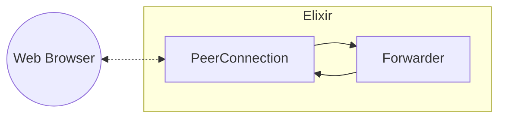

# Forwarding media data

Elixir WebRTC, in contrast to the JavaScript API, provides you with the actual media data transmitted via WebRTC.
That means you can be much more flexible with what you do with the data, but you also need to know a bit more
about how WebRTC actually works under the hood.

All of the media data received by the `PeerConnection` is sent to the user in the form of messages like this:

```elixir
receive do
  {:ex_webrtc, ^pc, {:rtp, track_id, _rid, packet}} ->
    # do something with the packet
    # also, for now, you can assume that _rid is always nil and ignore it
end
```

The `track_id` corresponds to one of the tracks that we received in `{:ex_webrtc, _from, {:track, %MediaStreamTrack{id: track_id}}}` messages.
The `packet` is an RTP packet. It contains the media data alongside some other useful information.

> #### The RTP protocol {: .info}
> RTP is a network protocol created for carrying real-time data (like media) and is used by WebRTC.
> It provides some useful features like:
>
> * sequence numbers: UDP (which is usually used by WebRTC) does not provide packet ordering, thus we need this to catch missing or out-of-order packets
> * timestamp: these can be used to correctly play the media back to the user (e.g. using the right framerate for the video)
> * payload type: thanks to this combined with information in the SDP offer/answer, we can tell which codec is carried by this packet
>
> and many more. Check out the [RFC 3550](https://datatracker.ietf.org/doc/html/rfc3550) to learn more about RTP.

Next, we will learn what you can do with the RTP packets.
For now, we won't actually look into the packets themselves, our goal for this part of the tutorial will be to forward the received data back to the same web browser.



The only thing we have to implement is the `Forwarder` process. In practice, making it a `GenServer` would be probably the
easiest and that's what we are going to do here. Let's combine the ideas from the previous section to write it.

```elixir
def init(_) do
  {:ok, pc} = PeerConnection.start_link(ice_servers: [%{urls: "stun:stun.l.google.com:19302"}])

  # we expect to receive two tracks from the web browser - audio and video
  # so we also need to add two tracks here, we will use them to loop media back t othe browser
  # from each of the web browser tracks
  stream_id = MediaStreamTrack.generate_stream_id()
  audio_track = MediaStreamTrack.new(:audio, [stream_id])
  video_track = MediaStreamTrack.new(:video, [stream_id])

  {:ok, _sender} = PeerConnection.add_track(pc, audio_track)
  {:ok, _sender} = PeerConnection.add_track(pc, video_track)

  # in_tracks (tracks we will receive from the browser) = %{id => kind}
  # out_tracks (tracks we will send to the browser) = %{kind => id}
  in_tracks = %{}
  out_tracks = %{audio: audio_track.id, video: video_track.id}
  {:ok, %{pc: pc, out_tracks: out_tracks, in_tracks: in_tracks}}
end
```

We started by creating the PeerConnection and adding two tracks (one for audio and one for video).
Remember that these tracks will be used to *send* data to the web browser peer. Remote tracks (the ones we will set up on the JavaScript side, like in the previous tutorial)
will arrive as messages after the negotiation is completed.

> #### What are the tracks? {: .tip}
> In the context of Elixir WebRTC, a track is simply a _track id_, _ids_ of streams this track belongs to, and a _kind_ (audio/video).
> We can either add tracks to the PeerConnection (these tracks will be used to *send* data when calling `PeerConnection.send_rtp/4` and
> for each one of the tracks, the remote peer should fire the `track` event)
> or handle remote tracks (which you are notified about with messages from the PeerConnection process: `{:ex_webrtc, _from, {:track, track}}`).
> These are used when handling messages with RTP packets: `{:ex_webrtc, _from, {:rtp, _rid, track_id, packet}}`.
> You cannot use the same track to send AND receive, keep that in mind.
>
> Alternatively, all of the tracks can be obtained by iterating over the transceivers:
>
> ```elixir
> tracks =
>   peer_connection
>   |> PeerConnection.get_transceivers()
>   |> Enum.map(&(&1.receiver.track))
> ```
>
> If you want to know more about transceivers, read the [Mastering Transceivers](https://hexdocs.pm/ex_webrtc/mastering_transceivers.html) guide.

Next, we need to take care of the offer/answer and ICE candidate exchange. This can be done the exact same way as in the previous
tutorial, so we won't get into here.

After the negotiation, we can expect to receive messages with notifications about new remote tracks.
Let's handle these and match them with the tracks that we are going to send to.
We need to be careful not to send packets from the audio track on a video track by mistake!

```elixir
def handle_info({:ex_webrtc, _from, {:track, track}}, state) do
  state = put_in(state.in_tracks[track.id], track.kind)
  {:noreply, state}
end
```

We are ready to handle the incoming RTP packets!

```elixir
def handle_info({:ex_webrtc, _from, {:rtp, track_id, nil, packet}}, state) do
  kind = Map.fetch!(state.in_tracks, track_id)
  id = Map.fetch!(state.out_tracks, kind)
  :ok = PeerConnection.send_rtp(state.pc, id, packet)

  {:noreply, state}
end
```

> #### RTP packet rewriting {: .info}
> In the example above we just receive the RTP packet and immediately send it back. In reality, a lot of stuff in the packet header must be rewritten.
> That includes SSRC (a number that identifies to which stream the packet belongs), payload type (indicates the codec, even though the codec does not
> change between two tracks, the payload types are dynamically assigned and may differ between RTP sessions), and some RTP header extensions. All of that is
> done by Elixir WebRTC behind the scenes, but be aware - it is not as simple as forwarding the same piece of data!

Lastly, let's take care of the client-side code. It's nearly identical to what we have written in the previous tutorial,
except for the fact that we need to handle tracks added by the Elixir's PeerConnection.

```js
// these will be the tracks that we added using `PeerConnection.add_track` in Elixir
// but be careful! event for the same track, the ids might be different for each of the peers
pc.ontrack = event => videoPlayer.srcObject = event.stream[0];
```

And that's it! The other peer should be able to see and hear the echoed video and audio.

> #### PeerConnection state {: .info}
> Before we can send anything on a PeerConnection, its state must change to `connected` which is signaled
> by the `{:ex_webrtc, _from, {:connection_state_change, :connected}}` message. In this particular example, we want
> to send packets on the very same PeerConnection that we received the packets from, thus it must be connected
> from the first RTP packet received.

What you've seen here is a simplified version of the [echo](https://github.com/elixir-webrtc/ex_webrtc/tree/master/examples/echo) example available
in the Elixir WebRTC Github repo. Check it out and play with it!

Now, you might be thinking that forwarding the media back to the same web browser does not seem very useful, and you're probably right!
But thankfully, you can use the gained knowledge to build more complex apps.

In the next part of the tutorial, we will learn how to actually do something with media data in the Elixir app.
