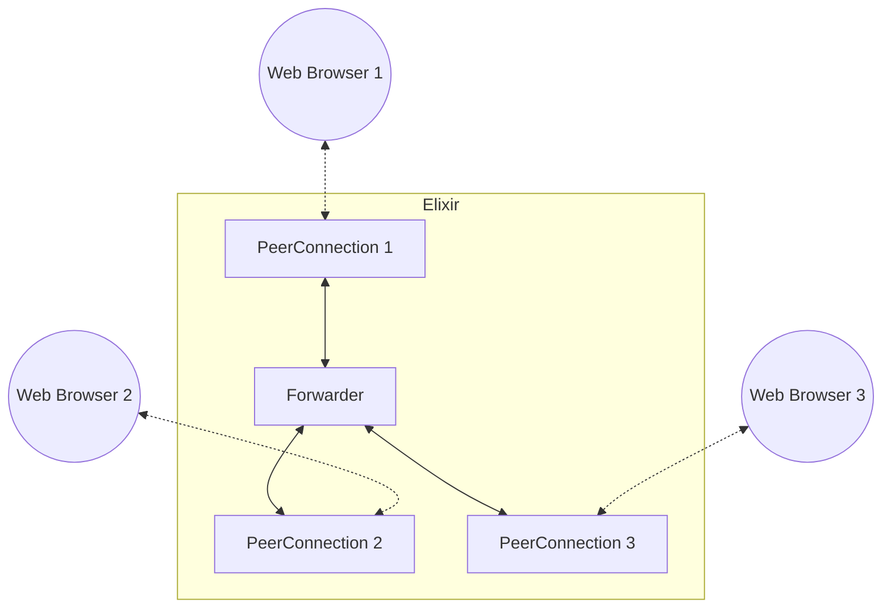
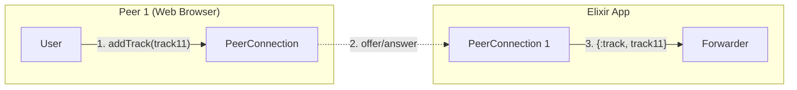
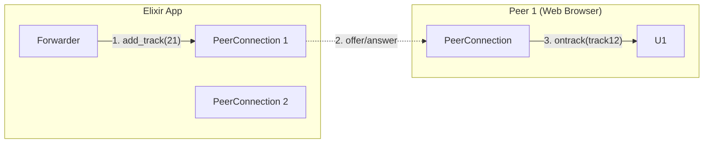

# Modifying the session

So far, we focused on forwarding the data back to the same peer. Usually, you want to connect with multiple peers, which means adding
more PeerConnection to the Elixir app, like in the diagram below.



In this scenario, we just forward packets from one peer to the other one (or even a bunch of other peers). This is a bit more challenging for a bunch of reasons:

## Negotiation gets more complex

You need to decide who starts the negotiation for every PeerConnection created - it can be either the client/web browser (so the case we went through
in the previous sections), the server, or both depending on when the peer joined. Also, don't forget that after you add or remove tracks from a PeerConnection,
new negotiation has to take place!

> #### The caveats of negotiation {: .tip}
> But wait, the peer who added new tracks doesn't have to start the negotiation?
>
> Certainly, that's the simplest way, but as long as the *number of transceivers* of the offerer (or, to be specific, the number of m-lines in the offer SDP with the appropriate
> `direction` attribute set) is greater or equal to the number of all tracks added by the answerer, the tracks will be considered in the negotiation.
>
> But what does that even mean?
> Each transceiver is responsible for sending and/or receiving a single track. When you call `PeerConnection.add_track`, we actually look for a free transceiver
> (that is, one that is not sending a track already) and use it, or create a new transceiver if we don' find anything suitable. If you are very sure
> that the remote peer added _N_ new video tracks, you can add _N_ video transceivers (using `PeerConnection.add_transceiver`) and begin the negotiation as
> the offerer. If you didn't add the transceivers, the tracks added by the remote peer (the answerer) would be ignored.

Let's look at an example:
1. The first peer (Peer 1) joins - here it probably makes more sense for the client (so the Web Browser) to start the negotiation, as the server (Elixir App/
`Forwarder` in the diagram) does not know how many tracks the client wants to add (the `2. offer/answer` message indicates the exchange of offer where the direction of
the arrow means the direction of the offer message).



2. The second peer (Peer 2) joins - now we need to make a decision: we want Peer 2 to receive track from Peer 1, but Peer 2 also wants to send some tracks.
We can either:
    - perform two negotiations: the first one, where Peer 2 is the offerer and adds their tracks, and the second one where the server is the offerer and adds
    Peer 1's tracks to Peer 2's PeerConnection.

    ```mermaid
    flowchart LR
      subgraph elixir [Elixir App]
        PCE1[PeerConnection 1]
        Forwarder-- "4. add_track(track12)" -->PCE2[PeerConnection 2]
        PCE2-- "3. {:track, track22}" -->Forwarder
      end

      subgraph P2["Peer 2 (Web Browser)"]
        U2[User]-- "1. addTrack(track22)" -->PCW2[PeerConnection]
        PCW2-- "6. ontrack(track12)" --> U2
      end

      PCW2-. "2. offer/answer" .->PCE2
      PCE2-. "5. offer/answer" .->PCW2
    ```

    - assuming that we expect only _N_ tracks from Peer 2, we can use the tip above and
    make sure that there are at least _N_ transceivers in Peer 2's PeerConnection on the Elixir side and do just a single negotiation.
    Note that you can also add transceivers without associated track, that's what you would need to do if
    _N_ in the diagram was greater than 1, because we only have a single track available.

    ```mermaid
    flowchart BR
      subgraph elixir [Elixir App]
        PCE1[PeerConnection 1]
        Forwarder-- "2. add_transceiver(track12)" -->PCE2[PeerConnection 2]
        PCE2-- "4. {:track, track22}" -->Forwarder
      end

      subgraph P2["Peer 2 (Web Browser)"]
        U2[User]-- "1. addTrack(track22)" -->PCW2[PeerConnection]
        PCW2-- "5. ontrack(track12)" --> U2
      end

      PCE2-. "3. offer/answer" .->PCW2
   ```

> #### Negotiation needed {: .tip}
> Instead of relying on gut feeling when it comes to performing the renegotiation, you can use the `negotiationneeded` event (of, in the case of Elixir WebRTC,
> `{:ex_webrtc, _from, :negotiation_needed}` message). It should fire every time renegotiation is needed. Be careful though! If you plan to add five tracks
> at once, do not perform five renegotiations by accident, when you could do only one at the very end!

3. Lastly, Peer 1 also wants to receive Peer 2's tracks, so we need to add the new tracks to Peer 1's PeerConnection and perform the renegotiation there.



> #### Who owns the tracks? {: .warning}
> Each of the tracks exists only in the context of its own PeerConnection. That means even if your Elixir App forwards media from one peer to
> another, it only takes RTP packets from a track in the first peer's PeerConnection and feeds them to another track in the second peer's PeerConnection.
> For instance, the role of `Forwarder` in the examples above would be to forward media in such way:
>
> ```mermaid
> flowchart LR
>   subgraph Forwarder
>     track11 -.-> track12
>     track22 -.-> track21
>   end
>   PC1[PeerConnection 1] --> track11
>   PC2[PeerConnection 2] --> track22
>   track12 --> PC2
>   track21 --> PC1
> ```
>
> This might be a bit counterintuitive, as in reality both of the tracks `track11` and `track12` still carry the same media stream.

A similar process would happen for all of the joining/leaving peers. If you want to check an actual working example, check out the
[Nexus](https://github.com/elixir-webrtc/apps/tree/master/nexus) - our Elixir, WebRTC-based videoconferencing demo app.
 
## Types of video frames

When speaking about video codecs, we should also mention the idea of different types of frames.

We are interested in these types (although there can be more, depending on the codec):
* I-frames (/intra-frames/keyframes) - these are complete, independent images and do not require other frames to be decoded
* P-frames (predicted frames/delta-frames) - these only hold changes in the image from the previous frame.

Thanks to this, the size of all of the frames other than the keyframe can be greatly reduced, but:
* loss of a keyframe or P-frame will result in a freeze and the receiver signaling that something is wrong and the video cannot be decoded
* video playback can only start from a keyframe

Thus, it's very important not to lose the keyframes, or in the case of loss, swiftly respond to keyframe requests from the receiving peer and produce a new keyframe, as
typically (at least in WebRTC) intervals between unprompted keyframes in a video stream can be counted in tens of seconds. As you probably realize, a 15-second video
freeze would be quite disastrous! It's also important to request a new keyframe when a new peer that's supposed to receive media joins, so they can start video
playback right away instead of waiting.

If you want to learn more about digital video, check out the [Digital video introduction](https://github.com/leandromoreira/digital_video_introduction) project.


## Matching codecs

When connecting two peers, you also have to make sure that all of them use the same video and audio codec, as the codec negotiation happens
completely separately between independent PeerConnections. If you're not familiar with how codecs are negotiated in a WebRTC session, get back
to the previous tutorial on consuming media data.

In a real scenario, you'd have to receive the RTP packet from the PeerConnection, inspect its payload type, find the codec associated with that payload type, find the payload type
associated with that codec on the other PeerConnection, and use it to overwrite the original payload type in the packet.

Unfortunately, at the moment the `PeerConnection.send_rtp` API forces you to use the topmost negotiated codec, so there's no way to handle RTP streams with changing codecs.
The only real solution is to force `PeerConnection` to negotiate only one codec.

```elixir
codec = %ExWebRTC.RTPCodecParameters{
    payload_type: 96,
    mime_type: "video/VP8",
    clock_rate: 90_000
}
{:ok, pc} = PeerConnection.start_link(video_codecs: [codec])
```

This is not ideal as the remote PeerConnection might not support this particular codec. This tutorial will be appropriately updated once the `PeerConnection` API allows
for more in this regard.

> #### WebRTC internals {: .tip}
> If you're developing using a Chromium-based browser, be sure to type out `chrome://webrtc-internals` in your address bar,
> you'll access a lot of WebRTC-related stats.
>
> If you ever see a black screen with the "loading" spinning circle instead of your video in the `video` HTML element, be sure
> to find your PeerConnection in the WebRTC internals, go to the `inbound-rtp(type=video, ...)` tab and check the `pliCount` stat.
> If you see it growing, but the video still does not load, you most likely are missing a keyframe and are not responding
> to the PLI (Picture Loss Indication) requests with a new keyframe.

In the case of a forwarding unit, like the example we have been examining in this section, we cannot really produce a keyframe, as we don't produce any video at all.
The only option is to send the keyframe request to the source, which in `ExWebRTC.PeerConnection` can be accomplished with the `PeerConnection.send_pli` function.
PLI (Picture Loss Indication) is simply a type of RTCP packet.

Usually, when forwarding media between peers, we would:
* send PLI to source tracks when a new receiving peer joins,
* forward PLI from source tracks to receiving tracks

This can be achieved with this piece of code similar to this:

```elixir
defp handle_info(:new_peer_joined, state) do
  for source <- state.sources do
    :ok = PeerConnection.send_pli(source.peer_connection, source.video_track_id);
  end
  {:noreply, state}
end

defp handle_info({:ex_webrtc, from, {:rtcp, packets}}, state) do
  for packet <- packets do
    case packet do
      %ExRTCP.Packet.PayloadFeedback.PLI{media_ssrc: ssrc} ->
        # TODO how to get the ids

        :ok = PeerConnection.send_pli(peer_connection, source_track_id)

      _other -> :ok
    end
  end

  {:noreply, state}
end
```

Just be careful to not overwhelm the source with PLIs! In a real application, we should probably implement some kind of rate limiting for the keyframe
requests.

